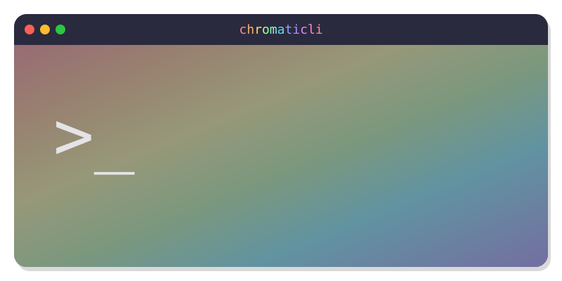

# ChromatiCLI

[](LICENSE)
[](https://github.com/cakeholeDC/chromaticli/actions/workflows/ci.yml)

<p align="center">
  
  <br>
  pronounced <em>chromatically</em> (/kroʊˈmæ.tɪ.kli/).
</p>

ChromatiCLI makes your terminal match the VS Code theme for the project you are in. When you `cd` into a folder with `.vscode/settings.json`, it reads `workbench.colorTheme` and repaints your terminal automatically.

It works with iTerm2, Terminal.app, Alacritty, Kitty, and any terminal that supports OSC color sequences.

**Platform support:** The terminal hook and OSC color sequences work on any platform (macOS, Linux) with a compatible terminal emulator (iTerm2, Terminal.app, kitty, Alacritty, WezTerm, and others that support OSC 10/11/12/4). Light/dark pair auto-switching via `window.autoDetectColorScheme` requires macOS (uses `defaults read -g AppleInterfaceStyle`). On Linux, pairs always apply the light half. Single themes work identically on all platforms.

---

## Why ChromatiCLI

- Helps you tell terminal sessions apart visually.
- Keeps terminal colors aligned with your VS Code workspace theme.
- Automatically reapplies the right palette whenever you change directories.
- Works with project-local `.vscode/settings.json`, so themes follow your repo.

---

## What it does

`chromaticli install` sets up everything needed to keep terminal colors in sync:

- `~/.local/bin/chromaticli` — the CLI executable on your path.
- `~/.config/chromaticli/hook.{zsh,bash,fish}` — shell hooks that run on directory changes.
- `~/.config/chromaticli/themes.json` — the theme and light/dark pair registry.
- A small source block in your shell rc file so the hook loads in every new shell.

Once installed, the hook finds the nearest `.vscode/settings.json`, maps the workspace theme to a terminal palette, and issues OSC color sequences.

---

## Prerequisites

- zsh, bash, or fish — any one is sufficient; install wires the hook into whichever shell you use
- `jq` (`brew install jq`)

### Optional tools

These are optional helpers for a better developer experience.

| Tool | What it adds | If missing |
|---|---|---|
| [`code`](https://code.visualstudio.com/docs/setup/mac#_launching-from-the-command-line) | `chromaticli set` can auto-install theme extensions | Themes still write to `settings.json`; VS Code prompts you to install on open |
| [`figlet`](https://www.figlet.org) | Fancy help-screen banner | Banner falls back to a simple ASCII box |
| [`lolcat`](https://github.com/busyloop/lolcat) | Rainbow help-screen banner | Banner renders in the default terminal color |

`jq` is the only required dependency because proper JSON merging is essential.

---

## Install

```sh
git clone https://github.com/cakeholeDC/chromaticli ~/dev/chromaticli
cd ~/dev/chromaticli
./chromaticli install
# Start a new shell session for the hook to load.
```

`install` detects your login shell via `$SHELL` and wires the hook automatically. To configure a different shell, use `--shell <zsh|bash|fish>`. To configure all supported shells at once, use `--all-shells`.

**For bash users:** the hook is added to `~/.bash_profile` (macOS opens login shells by default). If your setup only sources `~/.bashrc`, add the source line there manually.

**For fish users:** a one-line file is written to `~/.config/fish/conf.d/chromaticli.fish`. Fish auto-sources everything in `conf.d/` — no manual rc editing required.

Start a new shell session (or run `exec zsh`, `exec bash`, or `exec fish`) for the hook to take effect.

If `~/.local/bin` is not on your `PATH`, the installer prints a one-line `export PATH=...` advisory. It does not modify your path automatically.

The install step is idempotent, so you can run it again safely.

---

## Quick start

```sh
cd ~/some-project          # any project directory
chromaticli set monokai    # writes .vscode/settings.json and repaints terminal
cd ~                       # terminal returns to your default profile
cd ~/some-project          # terminal repaints automatically
```

- Use `chromaticli list` to browse all themes and pairs.
- Run `chromaticli set` without arguments to choose interactively.

---

## Upgrade

If you update the repo, reinstall to refresh the installed copies:

```sh
cd ~/dev/chromaticli
git pull
./chromaticli install --force
# then restart your shell:
exec zsh    # or exec bash / exec fish
```

`--force` overwrites the installed binary, hooks, and themes registry, and re-wires the rc file for the active shell (or all shells if `--all-shells` was used).

---

## Uninstall

### Installed via `git clone`

```sh
chromaticli uninstall
```

### Installed via Homebrew (future)

`brew uninstall` removes only the binary. It does **not** remove hook files or rc entries. Run `chromaticli uninstall` **before** `brew uninstall`:

```sh
chromaticli uninstall   # removes hooks, rc entries, and ~/.config/chromaticli/
brew uninstall chromaticli   # removes the binary from PATH
```

Skipping `chromaticli uninstall` leaves orphaned files in `~/.config/chromaticli/` and source lines in your shell rc. They are harmless but should be removed manually if the binary is gone.

---

`chromaticli uninstall` removes:

- `~/.local/bin/chromaticli`
- `~/.config/chromaticli/`
- The `chromaticli` source block from `~/.zshrc` (if present)
- The `chromaticli` source block from `~/.bash_profile` (if present)
- `~/.config/fish/conf.d/chromaticli.fish` (if present)

Project `.vscode/settings.json` files are left intact so VS Code continues to use them normally.

> **Note:** `uninstall` always removes hook wiring for all shells at once. There is no `--shell` flag to selectively de-wire one shell. If you want to remove only the fish hook, for example, delete `~/.config/fish/conf.d/chromaticli.fish` and remove the relevant source line manually.

---

## Commands

```sh
chromaticli <subcommand> [options]
chromaticli --help | -h
chromaticli --version | -v
```

| Command | Description |
|---|---|
| `install [--shell <zsh\|bash\|fish>] [--all-shells] [--force]` | Copy CLI and hooks; wire the hook into your shell rc (auto-detects login shell via `$SHELL` by default). |
| `uninstall` | Remove CLI, config dir, and hook wiring from all shells. |
| `list` | Show available themes and pairs with inline palette previews. |
| `set [<theme\|pair\|N>]` | Apply a theme to the current project. No arg opens an interactive picker. |
| `set --pair <id\|N>` | Apply a light/dark pair and follow macOS Appearance. |
| `set --theme <id\|N>` | Apply a specific single theme. |
| `unset [--project <dir>]` | Remove theme keys from `.vscode/settings.json` only. |
| `preview [<theme\|pair\|N>]` | Temporarily apply a theme without writing files; requires `chromaticli install`. Lasts until the next `cd`. |
| `sync [--project <dir>]` | Re-emit OSC colors to the current tty. Useful for debugging. |

Every subcommand supports `--help`.

---

## How it works

1. `chromaticli install` copies the CLI and all three shell hooks into your home config.
2. It wires only the selected shell, or your login shell by default.
3. The hook runs on each directory change (zsh: `chpwd`; bash: `PROMPT_COMMAND`; fish: `--on-variable PWD`).
4. It looks for the nearest `.vscode/settings.json`.
5. If a `workbench.colorTheme` is found, it maps that theme to a terminal palette.
6. The hook emits OSC color escapes for foreground, background, cursor, and ANSI colors.
7. In tmux, it wraps the sequences so the terminal receives them correctly.
8. Inside VS Code / Cursor integrated terminals, the hook skips emission by default because those environments already control terminal colors.

For light/dark pairs, the hook also re-checks macOS appearance and reapplies colors when the system changes.

---

## Themes

ChromatiCLI includes 12 curated themes and 2 light/dark pairs.

- Dark warm/earthy: `grass`, `kimbie-dark`, `monokai`, `red-sands`
- Dark cool/blue: `abyss`, `dark-modern`, `dark-pink`, `ocean`, `purple-rain`, `solarized-dark`
- Light: `light-modern`, `solarized-light`
- Pairs: `default` (light-modern ↔ dark-modern), `solarized` (solarized-light ↔ solarized-dark)

See the gallery at [`docs/theme_preview.md`](docs/theme_preview.md) or [`docs/theme_preview.html`](docs/theme_preview.html).

To propose a new theme, read the guidance in [`CONTRIBUTING.md`](CONTRIBUTING.md#adding-a-theme).

---

## Troubleshooting

**The terminal doesn’t change colors after `cd`.**

- There is no `.vscode/settings.json` in this directory or any parent. Run `chromaticli set <theme>` to create one.
- You are in a VS Code or Cursor integrated terminal. The hook skips OSC emission there by default. Use `CHROMATICLI_FORCE=1` to override.
- The hook isn’t loaded. `which _chromaticli_apply` should print `shell function`. If it does not, start a new shell session (or run `exec zsh`, `exec bash`, or `exec fish`) to pick up the latest hook.
- Your terminal does not support OSC 4/10/11/12. Test with:

  ```sh
  printf '\e]11;#ff0000\007'
  ```

**I use bash/fish and the hook isn’t firing after install.**

- For bash: check that `~/.bash_profile` contains the `# chromaticli` source line. If your setup sources `.bashrc` instead, add the line there manually. The hook is at `~/.config/chromaticli/hook.bash`.
- For fish: check that `~/.config/fish/conf.d/chromaticli.fish` exists. Run `exec fish` to reload. If the file is missing, rerun `chromaticli install`.

**`chromaticli preview` says "no hook found" even though the hook is firing on `cd`.**

`preview` spawns a subshell to emit colors and requires the installed hook file to exist at `~/.config/chromaticli/hook.<shell>`. Run `chromaticli install` first. In a fresh git clone, running `./chromaticli preview` without installing will now fail — this is intentional (the old fallback to the repo-side hook could not safely source across shell boundaries).

**I use bash/fish but `sync` and `preview` still invoke `hook.zsh`.**

chromaticli reads `$SHELL` to detect your login shell. On macOS, `$SHELL` reflects your *login* shell — if you spawned bash or fish from a zsh login session, `$SHELL` still points to zsh.

Use `--shell` to override:

```sh
chromaticli sync --project .    # uses $SHELL; may pick the wrong hook
SHELL=bash chromaticli sync     # explicitly uses the bash hook
```

To avoid this permanently, change your login shell:

```sh
chsh -s /bin/bash   # or /usr/local/bin/fish
```

**Nothing changes in tmux.**

Add `set -g allow-passthrough on` to `~/.tmux.conf` and reload tmux. The hook already wraps emissions for passthrough; tmux must forward them.

**`set --pair` does not follow Light/Dark on Linux.**

Appearance detection currently uses `defaults read -g AppleInterfaceStyle` on macOS only. On other platforms, pair mode defaults to the light theme. Single themes still work cross-platform.

**I pulled new repo code but behavior is still old.**

The installed files live in `~/.local/bin/` and `~/.config/chromaticli/`. Run `./chromaticli install --force` from the repo to update them.

**`install` refuses to overwrite `~/.local/bin/chromaticli`.**

That means another file already exists there. Inspect it, remove or rename it, then rerun install.

---

## Configuration

`chromaticli` is mostly zero-config.

| Environment variable | Effect |
|---|---|
| `CHROMATICLI_FORCE=1` | Force OSC emission even inside VS Code / Cursor integrated terminals. |

---

## Walkthrough

For a guided install/test/uninstall flow with expected output, see [`tests/SMOKE_TEST.md`](tests/SMOKE_TEST.md).

---

## Contributing and releases

All changes are made through pull requests and squash merged. Pull request titles use Conventional Commits because the title becomes the commit on `main`. See [`CONTRIBUTING.md`](CONTRIBUTING.md) for the accepted types and local checks.

Release Please turns those commits into a changelog and release pull request. Merging the release pull request creates a `vX.Y.Z` tag and GitHub release.

---

## Project layout

```text
/chromaticli          bash CLI executable
/hook.zsh             zsh hook sourced by `.zshrc`
/hook.bash            bash hook sourced by `.bash_profile`
/hook.fish            fish hook sourced via conf.d shim
/themes.json          theme and pair registry
/release-please-config.json       release behavior and changelog configuration
/.release-please-manifest.json    last released version
/.github/workflows/               CI, PR-title, and release workflows
/tests/SMOKE_TEST.md  manual walkthrough
/docs/
  theme_preview.md    theme gallery for GitHub
  theme_preview.html  standalone preview page
  themes/*.svg        per-theme mock-terminal previews
```
