# chromaticli — preview gallery

12 themes in 3 buckets, plus 2 auto pairs. Generated from `themes.json` via `scripts/generate-preview.py`. Pick a card and pass its id to `chromaticli set`.

## Dark — warm / earthy

| | | |
|---|---|---|
| 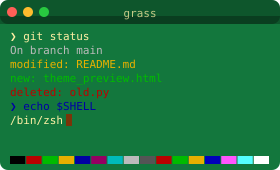 <code>grass</code> | 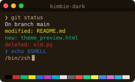 <code>kimbie-dark</code> | 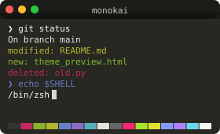 <code>monokai</code> |
| 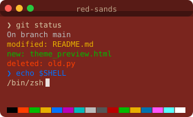 <code>red-sands</code> |  |  |

## Dark — cool / blue

| | | |
|---|---|---|
| 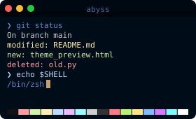 <code>abyss</code> | 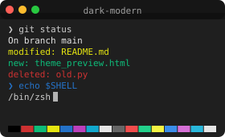 <code>dark-modern</code> | 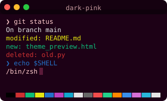 <code>dark-pink</code> |
| 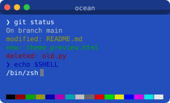 <code>ocean</code> | 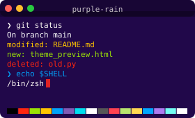 <code>purple-rain</code> | 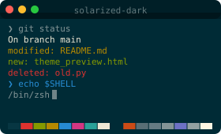 <code>solarized-dark</code> |

## Light

| | | |
|---|---|---|
| 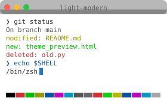 <code>light-modern</code> | 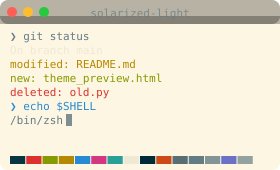 <code>solarized-light</code> |  |

## Pairs (auto light/dark)

Set with `chromaticli set --pair <id>`. On macOS the hook re-evaluates on every prompt and flips when System Settings → Appearance changes. Other OSes currently stick on the light half — see Troubleshooting in the README.

### `default`

| Light | Dark |
|---|---|
|  <code>light-modern</code> |  <code>dark-modern</code> |

### `solarized`

| Light | Dark |
|---|---|
|  <code>solarized-light</code> |  <code>solarized-dark</code> |
